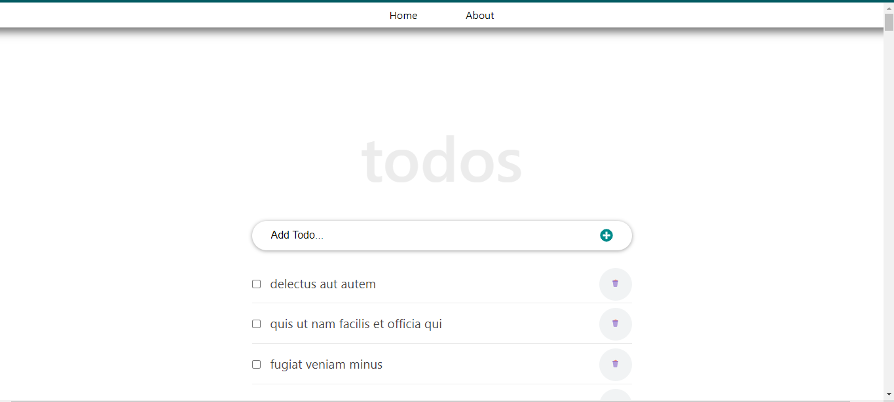

## Project Name

# to-do-list-react

# PR
You can add daily activities to this todo list web app.
## Built With

- Html
- css
- JavaScript with React.js

## live demo :
-not yet

## Getting Started

-You can run the deplyment version or you can install the code on your
- Machine then run npm start .

### Setup

-click the code button in the repo and then download the files as a zip file
-make sure you install npm if not run npm install on you cmd 
- make sure to install react libraries like react-router-dom 
- react-script

#### To get a local copy up and running follow these simple example steps.

- Click the green `Code` button on the repo and copy link
- In your local PC, open your terminal in the folder you would like to clone the project.
- Clone the repo with the command: `git clone (copied link)`; like so: `https://github.com/MeqdamAlqudah/to-do-list-react`
- On the terminal, navigate into the directory like so: `cd to-do-list-react`
-  first running npm i and npm start

### Prerequisites

Chrome or any explorer

## Authors

👤 **Meqdam Al-qudah**

- [GitHub](https://github.com/MeqdamAlqudah)
- [Twitter](https://twitter.com/MeqdamQudah)
- [LinkedIn](www.linkedin.com/in/meqdam-al-qudah-7514a21b5)

## 🤝 Contributing

Contributions, issues, and feature requests are welcome!

Feel free to check the [issues page](../../issues/).

## Show your support

Give a ⭐️ if you like this project!

## Acknowledgments

-I got my inspiration for this code from Ibas Majid
-from his tutorial check this link for more information
https://ibaslogic.com/about/

## 📝 License

This project is [MIT](./MIT.md) licensed.
